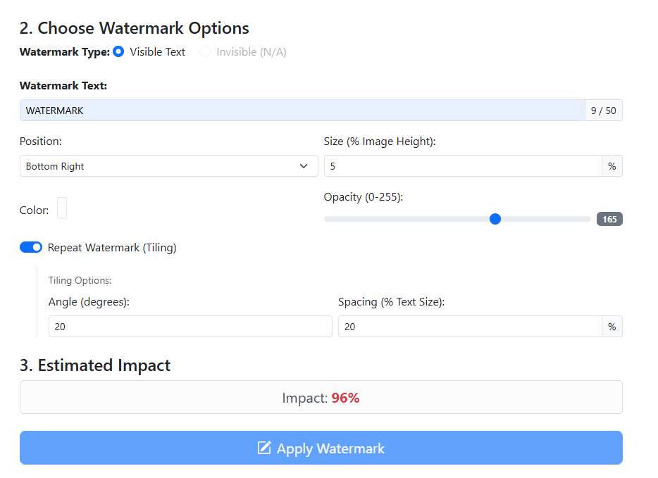
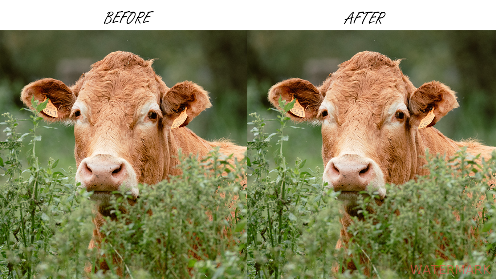
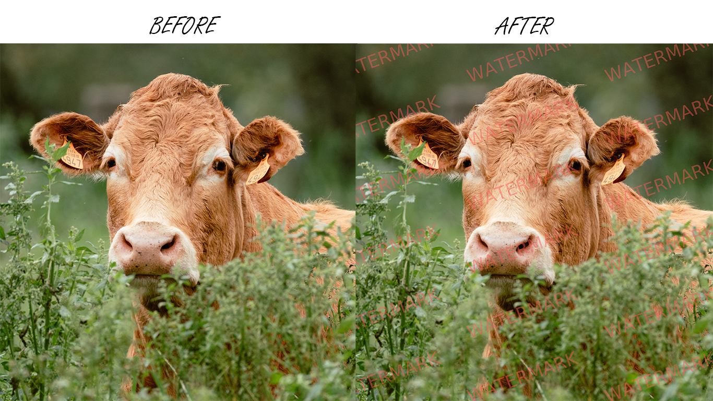

# PhantomSeal : A Watermarking App

[](https://www.gnu.org/licenses/gpl-3.0)
[]() []()

> A software tool designed to embed robust, pixel-level digital watermarks into images. It protects visual creations by incorporating identifiable data resistant to common manipulations like resizing and compression, all while preserving maximum image quality. The software provides functions for both adding and reading these watermarks, offering an essential solution for creators and professionals needing to secure and track their visual assets.

---
## Key Features ✨

* **Intuitive Web Interface:** Upload images via drag-and-drop or file selection.
* **Visible Text Watermark:** Apply your chosen text onto the images.
* **Advanced Customization:**
    * Choice of **position** (corners, center, edges).
    * Adjustment of font **size** (relative to image size).
    * Selection of **color** (via color picker).
    * Control over text **opacity** (transparency).
    * Option for **tiling** the watermark across the entire image.
    * Adjustment of rotation **angle** (for tiling or single watermark).
    * Adjustment of **spacing** between repetitions (for tiling).
* **Multiple Upload:** Process several images at once.
* **Client-Side Validation:** Checks for file count, extension, and maximum size per file.
* **Results Gallery:** View previously processed images in an integrated gallery.
* **Automatic Gallery Management:** Keeps only a defined number of the most recent images (retention policy).
* **Unique Filenames:** Generated images have a unique identifier to prevent overwriting.
* **Easy Configuration:** Adjustable settings via the `config.py` file.

## Gallery Overview 🖼️

Processed images are saved and viewable on the Gallery page.

## Installation and Launch 🚀

1.  **Clone the Repository:**
    ```bash
    git clone https://github.com/ClementLG/PhantomSeal.git
    cd phantomseal
    ```

2.  **Create a Virtual Environment (Recommended):**
    ```bash
    python -m venv venv
    # Activate the environment:
    # Windows:
    # venv\Scripts\activate
    # macOS/Linux:
    # source venv/bin/activate
    ```

3.  **Install Dependencies:**
    ```bash
    pip install -r requirements.txt
    ```

4.  **Create Necessary Folders:**
    Ensure the following folders exist at the project root (or in the `app/` subfolder if your `app.py` is located there):
    * `uploads/` (for temporary files)
    * `outputs/` (for final watermarked images)
    * `static/fonts/` (or the path defined in `config.py` for your font)

5.  **Add a Font:**
    * Download a `.ttf` or `.otf` font file (e.g., [DejaVu Sans](https://dejavu-fonts.github.io/)).
    * Place it in the fonts folder (e.g., `static/fonts/`).
    * Ensure the `FONT_PATH` variable in `config.py` correctly points to this file.

6.  **Configure (Optional):**
    * Modify the `config.py` file to adjust settings (file limits, max size, font, etc.).

7.  **Launch the Application:**
    ```bash
    # Make sure you are in the directory containing app.py
    python app.py
    ```

8.  **Access the Application:**
    * Open your browser and go to `http://127.0.0.1:5000` (or the address shown in the terminal).

## Configuration ⚙️

The main application settings can be adjusted in the `config.py` file:

* `MAX_FILES`: Maximum number of files per upload.
* `ALLOWED_EXTENSIONS`: Set of allowed image file extensions.
* `UPLOAD_FOLDER`: Folder for temporary uploads.
* `OUTPUT_FOLDER`: Folder where watermarked images are saved.
* `MAX_FILE_SIZE_MB`: Maximum allowed size for *each* uploaded file (in MB).
* `MAX_CONTENT_LENGTH`: Maximum total size of the upload request (calculated in bytes).
* `MAX_VISIBLE_TEXT_LENGTH`: Maximum length of the watermark text.
* `FONT_PATH`: Absolute or relative path to the `.ttf` or `.otf` font file.
* `MAX_GALLERY_FILES`: Maximum number of images to keep in the `outputs` folder (oldest ones are deleted).

## Using the Interface 🖱️

1.  **Upload:** Drag and drop images or click "Browse Files" to select files (respect the limits on number, size, and type). Upload errors are displayed in this area.
2.  **Preview:** Valid images appear as thumbnails. Click the 'X' to remove an image from the selection.
3.  **Options:** Choose the watermark type (only "Visible Text" is implemented), enter your text, and adjust the settings (position, size, color, opacity, tiling, angle, spacing).
4.  **Estimated Impact:** An estimate of the "degradation" rate (visual impact) is displayed and updated based on the options. The color indicates the impact level (Green=Low, Orange=Medium, Red=High).
5.  **Apply:** Click "Apply Watermark". Processing occurs on the server side.
6.  **Result:** A message appears below the button, indicating success or failure for each file. If successful, a download link is provided.

## Examples <caption>

* Config UI

     


* Example 1: Simple watermark in the bottom right corner.

     

* Example 2: Tiled watermark with rotation.

     


## Contributing 🤝

Contributions are welcome! Feel free to open an issue to report a bug or suggest a feature, or submit a pull request.

## License 📜

This project is distributed under the **GNU General Public License v3.0**. See the `LICENSE` file (which you should add to the repository) or [https://www.gnu.org/licenses/gpl-3.0.html](https://www.gnu.org/licenses/gpl-3.0.html) for more details.

This is a copyleft license, which means that any derivative works or distributions must also be licensed under the same GPLv3 terms. You are free to use, modify, and distribute this software according to the license conditions.

---
